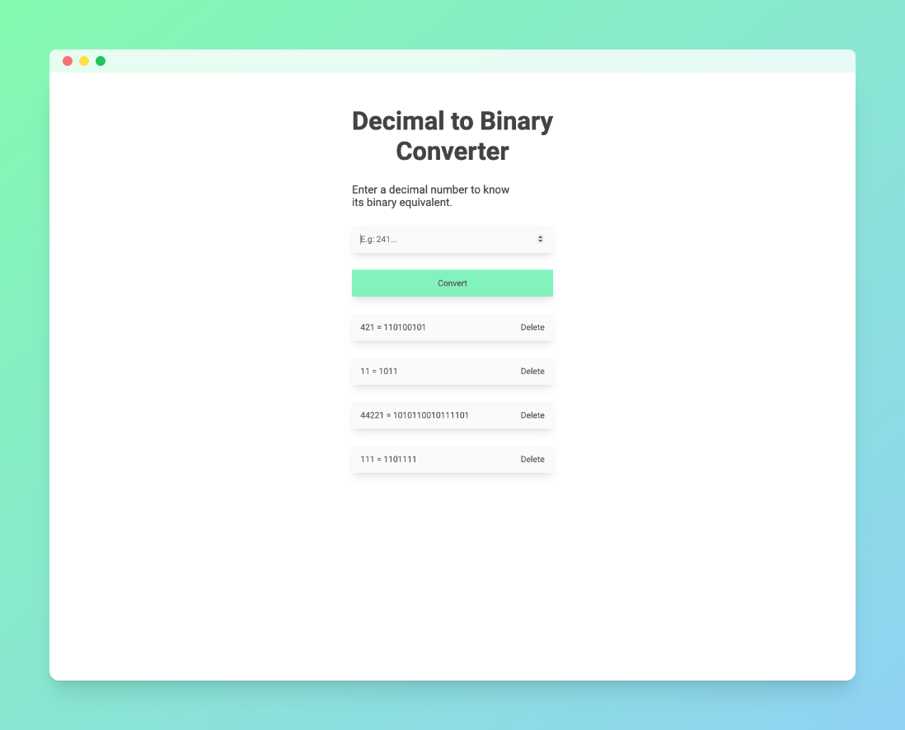

# 🚀 Decimal to Binary Converter 🚀

Convierte números decimales a binarios, este proyecto surge de la idea de conectar dos asignaturas de la universidad, Sistema de procesamiento de datos y Programación.
## Tecnologías Utilizadas 💻

- JavaScript
- Sass
- HTML
- Webpack

---

[DEMO](https://decimaltobinary.vercel.app/)
